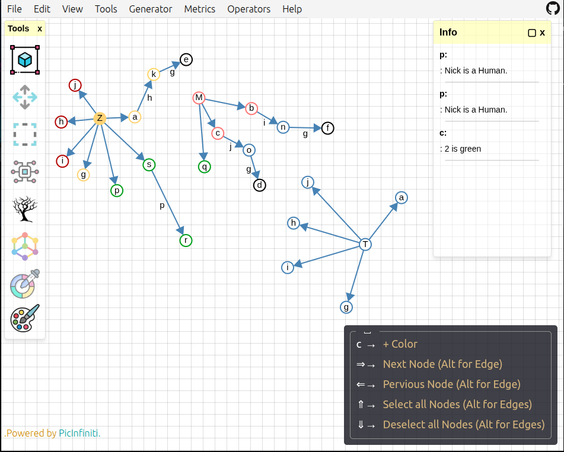
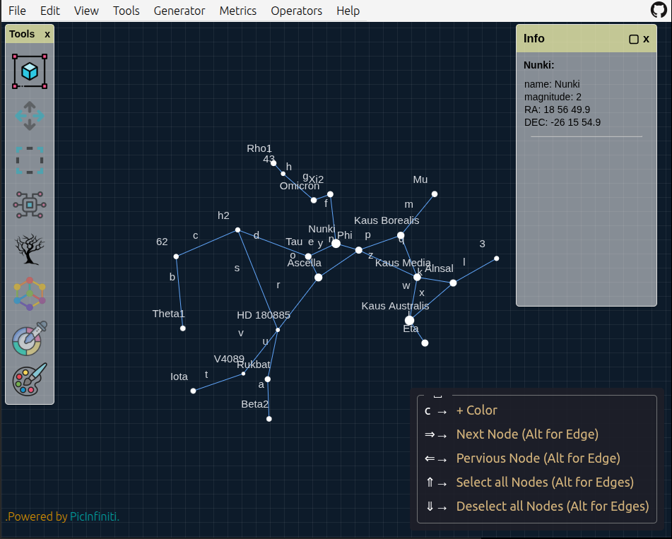

# 🌌 Graph Studio


**Graph Studio** is a modern, browser-based graph creation and analysis platform built with **D3 (Canvas)** and **Graphology.js**. Whether you're exploring graph theory, modeling networks, or visualizing data, Graph Studio offers a rich, intuitive environment tailored for both casual users and researchers.

👉 [Live Demo](https://graph.picinfiniti.net/)

---

## 🚀 What's New

- 🔁 **Support for Weighted Graphs** — Works with both undirected and directed graphs.
- 🏷️ **Editable Labels, Descriptions, and Weights** — For both nodes and edges.
- 🎨 **Advanced Color Picker** — Includes alpha transparency support.
- ⌨️ **Vim-like Shortcuts** — Copy (y), Cut (x), Paste (p), Undo (u), Redo (Ctrl+r), etc.
- 🎹 **Key Chord Navigation** — Activate and toggle shortcuts with `Space`.
- 🔼 **Arrow Key Navigation** — Select and deselect nodes/edges with arrows and Alt+arrows.

---

## ✨ Features Overview

### 📁 File Menu

- 🆕 Create new graphs or digraphs
- 📂 Import JSON graphs
- 💾 Export graphs or save as PNG
- 🌙 Toggle Night Sky Theme
- 🔄 Reload workspace or reset to defaults

### ✏️ Edit Menu

- 🧩 Organize (Circle layout), Complete Graph
- 🎯 Add Edge / Directed Edge
- 🗑️ Delete, Copy, Cut, Paste
- 🎨 Assign Color with full RGBA control
- 🔠 Rename, Edit Descriptions, Edit Weights
- 🔄 Undo / Redo
- ⚙️ Customize:

  - Vertex/Edge size, Stroke width
  - Label size, Grid visibility and density
  - Toggle label types (vertex/edge/weight)

### 👁️ View Menu

- 🧾 Toggle Info & Tools Panels
- ⌨️ Enable/Disable Key Chord Mode (⎵)

### 🧰 Tools Menu

- 🌳 Tree generator, Force-directed layout
- 🖱️ Panning, Selecting, Scaling
- 🎨 Quick access Color Picker (Alt+C)

### ⚙️ Generator Menu

Create graphs from built-in templates:

- **Classic Graphs:** Kₙ, Kₙ,ₙ, Pₙ, Cₙ, Lₙ, Empty
- **Community:** Caveman, Connected Caveman
- **Random Models:** Clusters, Erdős-Rényi, Girvan-Newman
- **Famous Graphs:** Krackhardt Kite, Karate Club, Florentine Families
- **Zodiac Constellations:** Real astronomical data with RA/DEC, magnitude

### 📊 Metrics Menu

- **Basic:** Degree Sequence, Density, Components, Diameter
- **Centrality:** Betweenness, Closeness, PageRank, Eigenvector
- **Layout Quality:** Edge Uniformity, Neighborhood Preservation, Stress
- **Other:** Simmelian Strength, Disparity
- 🔍 Explore: Shortest Path, Neighbors, Selected Info

### 🔁 Operators

- Convert: Graph ⇌ Digraph, Weighted ⇌ Unweighted
- Reverse Edge Direction

### ❓ Help Menu

- 💡 Usage Guide, Touch Commands, About

---

## 🖐 Touch & Keyboard Controls

### Touch

- Double-tap to create a node
- Select + tap to select
- Drag to move

### Keyboard (Key Chord Mode)

- `Space`: Toggle shortcut mode
- `y/x/p`: Copy, Cut, Paste
- `e/E`: Add Edge / Directed Edge
- `Alt + Arrow`: Precise selection
- `Ctrl + r`: Redo

---

## 📸 Screenshots

### Interface Overview



### Night Sky Mode



---

## 🛠 Installation

Clone and run locally:

```bash
git clone https://github.com/PicInfiniti/graph-studio.git
cd graph-studio
npm install
npm run dev
```

Or explore instantly at: 👉 [https://graph.picinfiniti.net/](https://graph.picinfiniti.net/)

---

## 🧪 Built With

- [D3.js (Canvas)](https://d3js.org/)
- [Graphology.js](https://graphology.github.io/)
- JavaScript (ES6+), HTML5, CSS3

---

## 📚 Citation

If this tool assists your academic work, please cite:

**BibTeX:**

```bibtex
@misc{graphstudio2025,
  author       = {PicInfiniti},
  title        = {Graph Studio: An Interactive Tool for Graph Visualization and Analysis},
  year         = {2025},
  howpublished = {\url{https://graph.picinfiniti.net}},
}
```

---

## 📄 License

Licensed under the [MIT License](./LICENSE).
Free to use, modify, and share — just credit the original author.

---

## 🤝 Contributing

Suggestions, issues, and PRs are welcome!
Check the issues tab or submit a pull request to improve Graph Studio.

---

## 🌠 Author

Created by **[PicInfiniti](https://github.com/PicInfiniti)** — fueled by curiosity and a love for the stars.

Check the `About` section in-app for version info and more.
