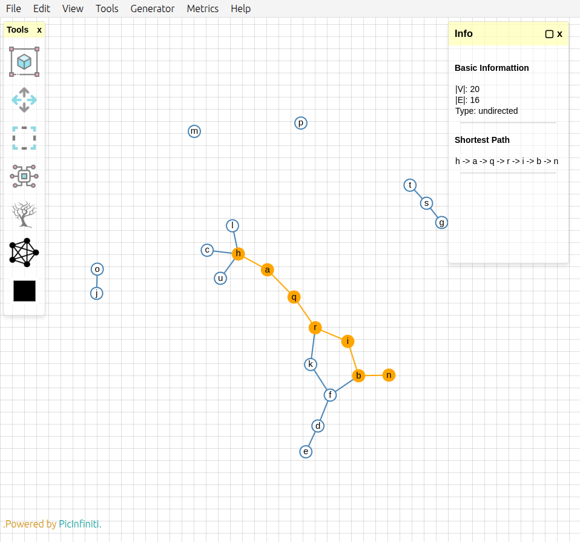
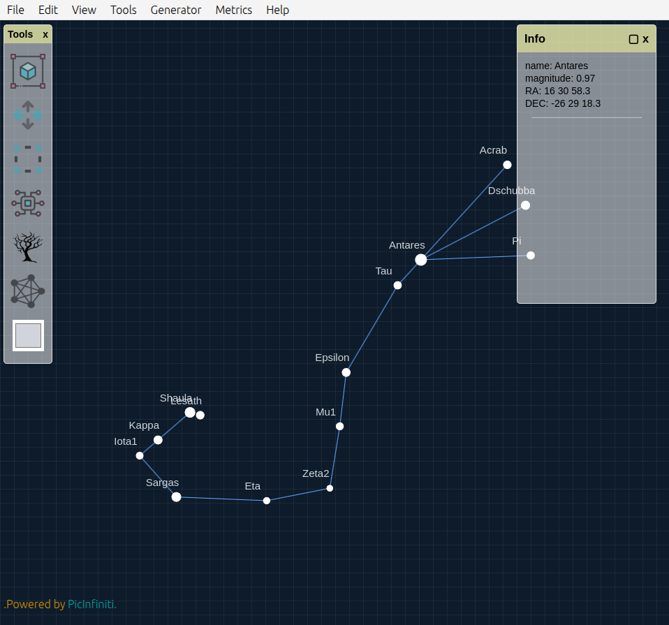

# 🌌 Graph Studio


**Graph Studio** is an interactive web application built with **D3 Canvas** and **Graphology.js**, designed for creating, visualizing, and analyzing **simple undirected and directed graphs**. It is touchscreen-friendly, intuitive, and packed with powerful tools for students, developers, researchers, or anyone interested in graph theory.

👉 [Live Demo](https://graph.picinfiniti.net/)

---

## ✨ Features

### 📁 File Menu

- 🆕 New Graph
- 📂 Import Graph
- 💾 Export Graph (JSON)
- 🖼️ Export as PNG
- ⚙️ Reset to Default Settings
- 🌙 Toggle Night Sky Mode

### ✏️ Edit Menu

- Organize Nodes (Circle layout)
- Complete Graph
- Delete Selected Nodes/Edges
- Assign Color
- Add Edge
- Undo / Redo
- Customize:
  - Vertex size
  - Edge thickness
  - Stroke width
  - Label size
  - Grid visibility & size

### 👁️ View Menu

- Toggle Info Panel (required to view metrics)
- Toggle Tool Panel

### 🧰 Tools Menu

- Force Simulation
- Tree Maker
- Panning, Selecting, Scaling
- Drag Components

### ⚙️ Generator Menu

Create graphs from templates:

- **Classic Graphs** (Empty, Kₙ, Kₙ,ₙ, Pₙ, Cₙ, Lₙ)
- **Community Structures** (Caveman, Connected Caveman)
- **Random Graphs** (Clusters, Erdős–Rényi, Girvan–Newman)
- **Small Graphs** (Krackhardt Kite)
- **Social Networks** (Zachary’s Karate Club, Florentine Families)
- **Zodiac** – 13 constellations with real astronomical data  
  *(Click any star to view info like name, magnitude, RA/DEC in the Info Panel)*

Each generator includes documentation and Wikipedia links to learn more.

### 📊 Metrics Menu

- **Basic:** Components, Degree Sequence, Density, Diameter, etc.
- **Centrality:** Betweenness, Closeness, Degree, Eccentricity, PageRank, Eigenvector
- **Layout Quality:** Edge Uniformity, Neighborhood Preservation, Stress
- **Other:** Simmelian Strength, Disparity
- Tools for:
  - Shortest Path (requires two selected nodes)
  - Node Neighbors
  - Clear Info Panel

### ❓ Help Menu

- Mouse/Touch Commands
- How to Use
- About (version: 1.0.0)

---

## 🖐 Touch Support

- Double-tap to add a node
- Drag to move
- Long-tap to select
- Fully compatible with tablets and touchscreen devices

---

## 📸 Screenshots

### UI Overview



### Night Sky Mode



---

## 🛠 Installation

To run locally:

```bash
git clone https://github.com/PicInfiniti/graph-studio.git
cd graph-studio
npm install
npm run dev
```

Or try it online:  
👉 [https://graph.picinfiniti.net/](https://graph.picinfiniti.net/)

---

## 🧪 Tech Stack

- [D3.js (Canvas)](https://d3js.org/)
- [Graphology.js](https://graphology.github.io/)
- JavaScript (ES6+)
- HTML5 + CSS3

---

## 🧭 Directed Graphs

Graph Studio now supports **directed graphs (digraphs)**!

- Use the selection order system to define direction:
  - The first selected node becomes the source
  - The next becomes the target
- Add directed paths, chains, and DAG structures interactively
- Export, visualize, and analyze directed edges alongside your graph

This makes Graph Studio even more powerful for modeling workflows, hierarchies, and network flows.

---

## 📄 License

This project is licensed under the [MIT License](./LICENSE).  
You are free to use, modify, and build upon it — just **please credit the original project**.

---

## 🤝 Contributing

Contributions, feedback, and feature suggestions are welcome!  
Feel free to open an issue or pull request.

---

## 🪐 Author

Developed by **[PicInfiniti](https://github.com/PicInfiniti)** with love for graphs and starlight. 🌟  
Check out the `About` section in the app for more details and version info.

---
