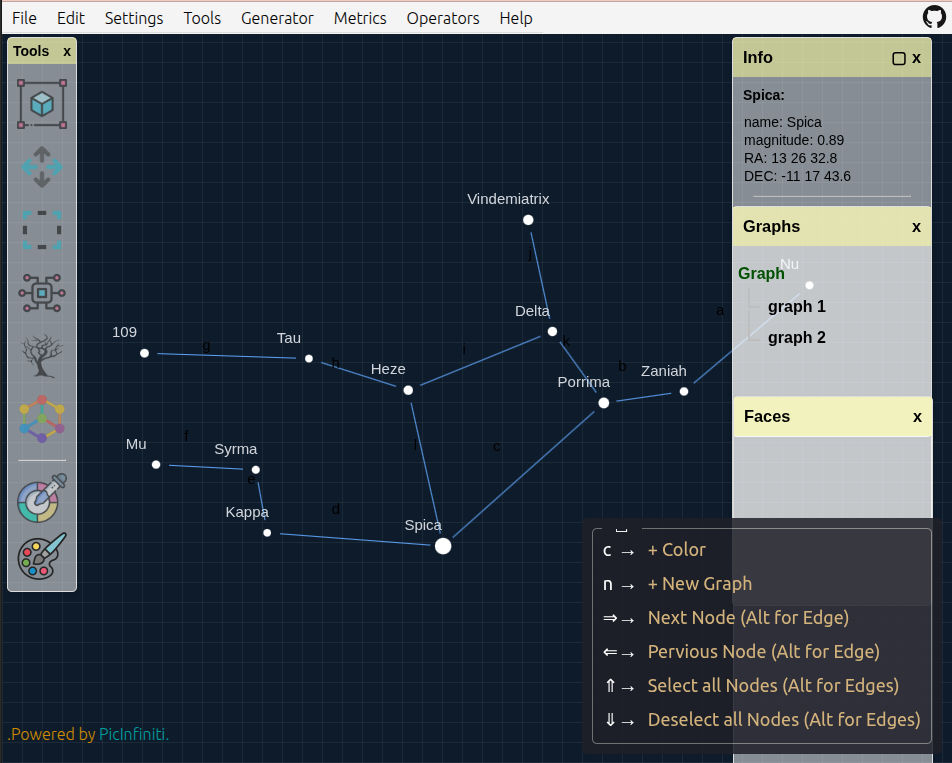

# 🌌 Graph Studio


**Graph Studio** is a powerful, browser-based platform for building, visualizing, and analyzing graphs. Built using **D3.js (Canvas)** and **Graphology.js**, it supports complex graph modeling with a sleek interface and deep analytical tools — now reengineered with multi-layer canvas rendering for better performance and richer interaction.

👉 [Live Demo](https://graph.picinfiniti.net/)

---

## 🚀 What's New in v1.9.3

- 🎯 **Canvas Layer Overhaul** — Uses 4 separate canvas layers (nodes, edges, faces, interaction) for smoother rendering and control.
- 🔺 **Face Support** — Define and color enclosed cycles using the new _Face_ tool (`Ctrl+F`). Each face is editable and visible in the _Faces Panel_.
- 🌐 **Subgraphs** — Select any group of nodes to create reusable, editable subgraphs. View/edit from the _Graphs Panel_.
- 📝 **Full Metadata Editing** — Add/edit labels, weights, and descriptions for nodes, edges, faces, and subgraphs.
- 📑 **Dedicated Panels** — Manage everything from separate _Info_, _Graphs_, and _Faces_ panels. Toggle them from `Settings → View`.
- 🧠 **Shortcut Chord System** — Combine key sequences like `Space → c → c` for quick tool access (see guide below).
- 💾 **Autosave** — Your graph state and history are saved in-browser between sessions. Recover work even after tab closes.
- ⚙️ **Performance Mode** — Disable animations for smoother handling of large graphs (enable from `Settings → Performance`).
- 📦 **Export Includes History** — Save full state (graph + edit history) in JSON exports.
- 🧰 **New Operators Menu** — Control layout (flip, rotate, force atlas), convert graph types, generate subgraphs, and more.

---

## ✨ Features Overview

### 📁 File Menu

- 🆕 New Graph (Mixed / Directed / Undirected)
- 📂 Import JSON graphs
- 💾 Export Graph (JSON with history)
- 🖼️ Export PNG snapshot
- 🌙 Sky Night Theme
- 🔄 Reload workspace

### ✏️ Edit Menu

- ➕ Add Edge / Directed Edge / Face (`Ctrl+F`)
- 🗑️ Delete, Copy, Cut, Paste
- 🎨 Assign Color (RGBA, label, edge, fill, stroke)
- 🔠 Rename, Add Weight, Add Description
- 🔄 Undo / Redo

### ⚙️ Settings Menu

- 📐 Graph: label toggles, size sliders (vertex, edge, label, stroke)
- 🌌 View: toggle Info, Tools, Graphs, and Faces panels, Key Chord mode
- 🚀 Performance Mode: disables animations for large graphs
- 🕰️ History Options: limit memory size, disable autosave, clear saved data

### 🧰 Tools Menu

- 🔍 Zoom, Panning (`Ctrl`), Selecting (`Shift`), Component Selector (`Alt`)
- 🌳 Tree & Force Simulation tools
- 🎨 Quick Color Picker (`Space → c → c`)

### ⚙️ Generator Menu

Create graphs from built-in templates:

- **Classic:** Empty, Kₙ, Kₙ,ₙ, Pₙ, Cₙ, Lₙ
- **Community:** Caveman, Connected Caveman
- **Random:** Clusters, Erdős-Rényi, Girvan-Newman
- **Famous:** Krackhardt Kite, Karate Club, Florentine Families
- **Zodiac:** 13 real constellations with RA/DEC and magnitude

### 📊 Metrics Menu

- **Basic:** Degree Sequence, Density, Components, Diameter
- **Centrality:** Betweenness, Closeness, PageRank, Eigenvector
- **Layout Quality:** Edge Uniformity, Stress, Neighborhood Preservation
- **Extras:** Disparity, Simmelian Strength
- 🔍 Explore Neighbors, Shortest Path, Info Panels

### 🔁 Operators Menu (NEW)

- Layout: Organize, Rotate, Flip, Random, Force Atlas
- Convert: Graph ⇌ Digraph, Weighted ⇌ Unweighted
- Subgraph creation & selection
- Reverse direction, Complete Graph

### ❓ Help Menu

- 💡 Shortcut Guide, Mouse Commands, Usage Instructions, About (v1.9.3)

---

## 🖐 Touch & Keyboard Controls

### Touch

- Double-tap canvas: Add node
- Tap (Select Tool): Select nodes or edges
- Drag: Move node (with visual update after drop in Performance mode)

### Keyboard Shortcut Guide

#### ⌨️ Shortcut Notation

- `Alt+a` → Press **a** while holding **Alt**
- `Alt-a` → **Two different shortcuts**: `Alt` and `Alt + a`
- `Space cc` → Press **Space**, then **c**, then **c** (in sequence)

Chord keys show hints as you type. Examples:

- `Space → n → d`: Start a new **Directed** graph
- `Alt+e`: Add Edge (in order)
- `Ctrl+f`: Add Face (requires 3+ nodes forming a cycle)

---

## 💡 Tips for Large Graphs

- ⚙️ Enable **Performance Mode** (Settings → Performance)
  - Disables force animations
  - Defers redraws until after interactions
- 💾 Disable **Autosave History** for large graphs (Settings → History)
- ❌ If the app crashes or won’t load:
  - Go to **Settings → History → Clear History**, then reload
  - Always **export your graph** if you're doing important work
- 💡 Local autosave is limited — avoid using autosave with extremely large graphs. IndexedDB support coming in the future.

---

## 📸 Screenshots

### Graph Studio UI


### Night Sky Mode



---

## 🛠 Installation

Clone and run locally:

```bash
git clone https://github.com/PicInfiniti/graph-studio.git
cd graph-studio
npm install
npm run dev
```

Or open instantly at: 👉 [https://graph.picinfiniti.net/](https://graph.picinfiniti.net/)

---

## 🧪 Built With

- [D3.js (Canvas)](https://d3js.org/)
- [Graphology.js](https://graphology.github.io/)
- JavaScript (ES6+), HTML5, CSS3

---

## 📚 Citation

If this tool assists your academic work, please cite:

```bibtex
@misc{graphstudio2025,
  author       = {PicInfiniti},
  title        = {Graph Studio: An Interactive Tool for Graph Visualization and Analysis},
  year         = {2025},
  howpublished = {\url{https://graph.picinfiniti.net}},
}
```

---

## 📄 License

Licensed under the [MIT License](./LICENSE). Free to use, modify, and share — just credit the original author.

---

## 🤝 Contributing

Suggestions, issues, and PRs are welcome! Check the issues tab or submit a pull request to improve Graph Studio.

---

## 🌠 Author

Created by [**PicInfiniti**](https://github.com/PicInfiniti) — fueled by curiosity and a love for the stars.

Check the `About` section in-app for version info and more.
